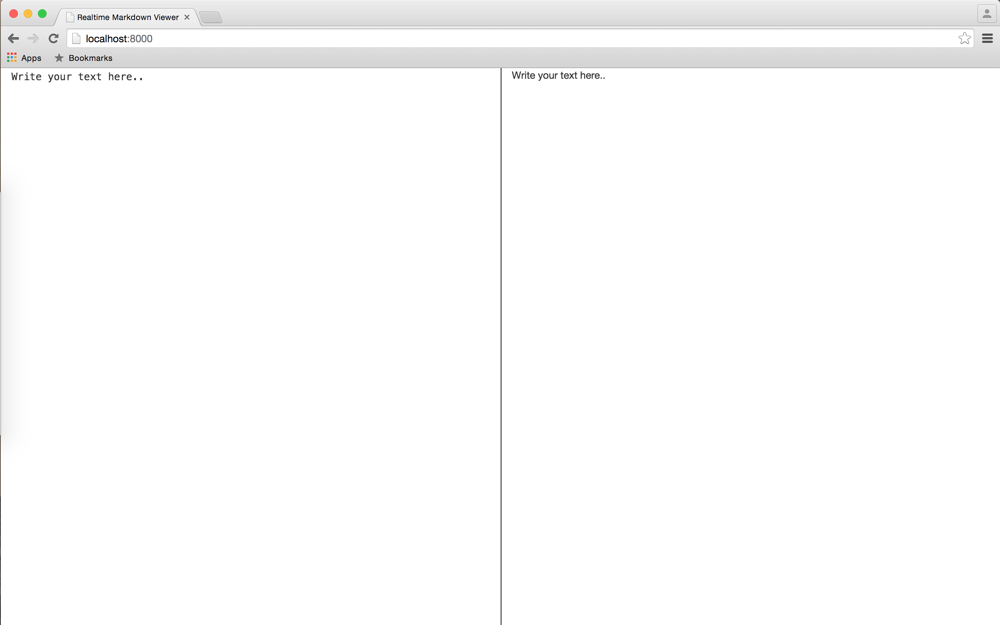

# Formation Git Elephorm

Tout au cours de ce TP, nous allons tenter d'écrire un convertisseur

Nous voulons que notre application sache faire plusieurs choses :

### Écrire des titres

# h1
## h2
### h3
#### h4
##### h5
###### h6

### Mettre des éléments en gras

**comme ici**

### Mettre des élements barrés
( ne fonctionne pas sous github )

~~comme ici~~

### Mettre des éléments en italique

*comme là*

### Écrire des liens

Voici la documentation de référence de [markdown](http://en.wikipedia.org/wiki/Markdown) et [HTML](http://en.wikipedia.org/wiki/HTML).

### Écrire des listes numérotées ou pas

1. At vero eos et accusamus et iusto odio dignissimos ducimus
2. Qui blanditiis praesentium voluptatum deleniti atque corrupti
  * Quos dolores et quas molestias excepturi sint
  * Obcaecati *cupiditate **non** provident*
  * Et harum quidem rerum facilis est et expedita distinctio
    1. Neque porro quisquam
    2. est qui dolorem ipsum
    3. quia dolor sit amet
    4. consectetur adipisci velit
3. Quis autem vel eum iure reprehenderit
4. qui in ea voluptate velit esse

### Afficher des lignes séparatrices

---

### Écrire du code


```
    var md   = document.getElementById("md").value,
    html = micromarkdown.parse(md);

```

### Pouvoir référencer des liens sur les réseaux sociaux.
( ne fonctionne pas sous github )

* Twitter @elephorm@t
* GitHub @sabativi@gh
* Facebook @elephorm@fb
* Google+ @elephorm@gp

## Fonctionnement de l'application

### Dépendances

L'application est développée en [nodejs](https://nodejs.org). Pour plus d'informations cliquez sur le lien.

Elle a besoin du [node package manager](https://www.npmjs.com) pour installer les dépendances.

Vous devez avoir `nodejs` et `npm` installé sur votre machine. L'installeur de nodejs est présent [ici](https://nodejs.org/download/). Npm est installé avec node. Si vous voulez plus d'informations avec notamment une vidéo de présentation, c'est [ici](https://docs.npmjs.com/getting-started/installing-node).

Assurez vous aussi d'avoir un compte github.

Une fois fait, vous devez :

1. Forker le repository : en cliquant sur le bouton fork en haut à droite. Ceci constituera votre copie du serveur sur laquelle vous pourrez partager des modifications.
2. Rentrer dans le répertoire : `cd Realtime-Markdown-Viewer`
3. Installer les dépendances : `npm install`
4. Lancez l'application : `npm run dev`
5. Allez à cette [url](http://localhost:8000)

Vous devez vous retrouver avec ceci comme écran : 

### Fonctionnement pour le TP.

Le répertoire qui nous intéresse est le répertoire `converter`. Vous n'aurez pas besoin de manipuler d'autres fichiers.

Ce dernier a la structure suivante :

* **markdown.js**
* tests/
	* markdown-test.js
	* **features/** 
	* utils.js

Le fichier `markdown` contient le parser.

Le répertoire `features` contient un ensemble de fichier markdown et html pour nos tests.

Lorsque nous ajoutons une nouvelle fonctionnalité, nous allons accompagner celle ci d'un test, afin de vérifier son bon fonctionnement.

Pour ajouter un test, il suffit d'ajouter un fichier markdown et un fichier html portant le même nom dans le répertoire.

Pour lancer les tests, la commande à éxécuter à la racine du projet est :

```
npm run test
```


À gauche, vous avez le panel dans lequel vous pouvez écrire du markdown et à droite le rendu HTML.


Nous avons déjà développé une fonctionnalité pour vous. Le parsing des différents titres.

Essayer le code suivant dans le panel de gauche :

```
# Un grand titre
### Un plus petit titre
##### Doit correspondre à une balise <h5>
 
```

Vous devriez avoir le panel de droite qui se met à jour automatiquement.

Par contre si vous essayez d'écrire :

```
**Ce texte doit apparaitre en gras**
```

Vous pouvez voir qu'il ne se passe rien.

Tout au cours de ce TP, nous allons ajouter des fonctionnalités à notre parser Markdown.

L'objectif du TP n'est pas de faire le parser, nous l'utilisons comme pretexte pour utiliser git, toutes les réponses vous seront données au cours du TP, par contre, vous devez comprendre ce que vous faites quand vous utilisez des commandes git.


